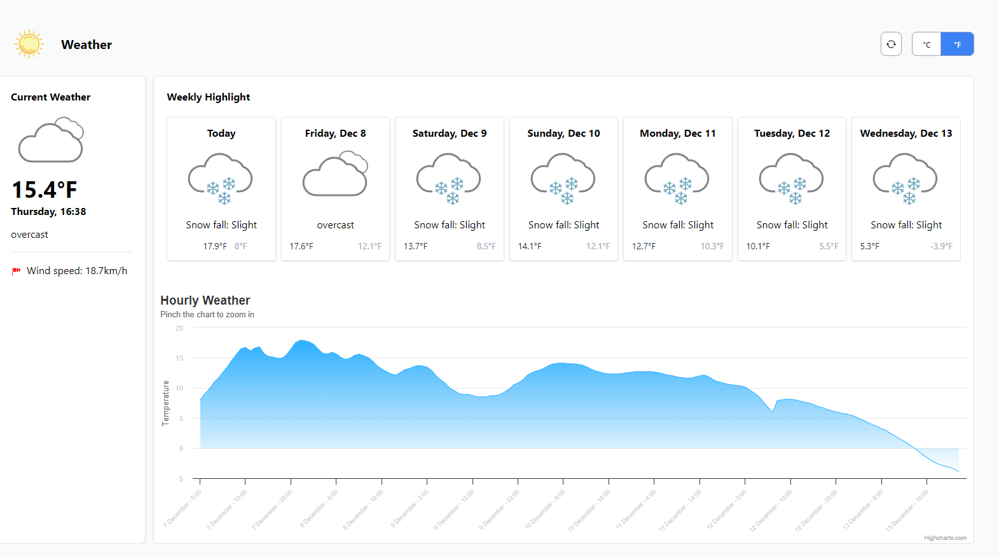

### Weather

### Description

This application is programmed with JavaScript. The UI implemented using React.js. The weather data is getting from the 'https://api.open-meteo.com/v1/forecast' API and will show like the picture below:

.

The default temperature unit is Celcius. You can see temperatures in Farenhite by pressing the F button (at the top-right of the page).

By clicking on the Refresh symbol, data will get again and output will update.

This page is responsive and can be shown correctly in every screen size.

#### Library used

- Tailwindcss version 3.3.5
- Highcharts version v11.2.0

### Dependencies

 - "@testing-library/jest-dom": "^5.17.0",
 - "@testing-library/react": "^13.4.0",
 - "@testing-library/user-event": "^14.5.1",
 - "@types/express": "^4.17.21",
 - "@types/jest": "^29.5.12",
 - "@types/node": "^20.12.4",
 - "@types/react": "^18.2.74",
 - "@types/react-dom": "^18.2.24",
 - "highcharts-react-official": "^3.2.1",
 - "react": "^18.2.0",
 - "react-dom": "^18.2.0",
 - "react-scripts": "5.0.1",
 - "react-test-renderer": "^18.2.0",
 - "tw-elements-react": "^1.0.0-alpha2",
 - "typescript": "^5.4.4",
 - "web-vitals": "^2.1.4"

#### Functions components

- Weather
  - It is the main function which uses other functions result and manipulate data to show the weather foreacst
- CreateDailyWeatherHTML
  - This function gets the daily part of the GET response and creates HTML based on it.
  - Parameters
    - weatherData : object contains daily forecast.
      - example
        ```javascript
               {
                "forecast": {
                    "0": {
                        "time": "2023-12-07",
                        "weather_code": 71,
                        "weather_code_des": "Snow fall: Slight",
                        "min_temp": -13.4,
                        "max_temp": -8.5
                    },
                    "1": {
                        "time": "2023-12-08",
                        "weather_code": 3,
                        "weather_code_des": "overcast",
                        "min_temp": -11.4,
                        "max_temp": -8.8
                    },
                    "2": {
                        "time": "2023-12-09",
                        "weather_code": 3,
                        "weather_code_des": "overcast",
                        "min_temp": -14.4,
                        "max_temp": -10.4
                    },
                    "3": {
                        "time": "2023-12-10",
                        "weather_code": 71,
                        "weather_code_des": "Snow fall: Slight",
                        "min_temp": -13.9,
                        "max_temp": -10.6
                    },
                    "4": {
                        "time": "2023-12-11",
                        "weather_code": 71,
                        "weather_code_des": "Snow fall: Slight",
                        "min_temp": -16.9,
                        "max_temp": -14.1
                    },
                    "5": {
                        "time": "2023-12-12",
                        "weather_code": 71,
                        "weather_code_des": "Snow fall: Slight",
                        "min_temp": -19.7,
                        "max_temp": -13.5
                    },
                    "6": {
                        "time": "2023-12-13",
                        "weather_code": 71,
                        "weather_code_des": "Snow fall: Slight",
                        "min_temp": -19.9,
                        "max_temp": -14.8
                    }
                },
                "unit": {
                    "max_unit": "°C",
                    "min_unit": "°C"
                }
            }
        ```
- CreateCurrentWeatherHTML
  - This function gets the current part of the GET response and creates HTML based on it.
  - Parameters
    - weatherData : object contains current weather.
      - example
      ```javascript
          {
              "time": "2023-12-07T16:30",
              "weather_code": 3,
              "weather_code_des": "overcast",
              "wind_speed": 19.4,
              "wind_speed_unit": "km/h",
              "temperature_2m": -10.4,
              "temp_unit": "°C"
          }
      ```
- CreateChart
  - This function gets the hourly part of the GET response and creates a chart (using Highcharts) based on it.
  - Parameters
    - weatherData : an object/array of hourly forecast data
      - example
        ```javascript
        [
          ["7 December - 0:00", -13.4],
          ["7 December - 9:00", -8.6],
          ["7 December - 10:00", -8.5],
          ["7 December - 11:00", -8.8],
          ["7 December - 12:00", -8.6],
          ["7 December - 13:00", -8.5],
          ["7 December - 14:00", -9.1],
          ["7 December - 15:00", -10],
          ["7 December - 16:00", -10.4],
          ["7 December - 17:00", -10.4],
          ["7 December - 18:00", -10.4],
          ["7 December - 19:00", -10.2],
          ["7 December - 20:00", -9.6],
          ["7 December - 21:00", -9.1],
          ["7 December - 22:00", -8.7],
          ["7 December - 23:00", -8.6],
          ["8 December - 0:00", -8.8],
          ["8 December - 1:00", -8.9],
          ["8 December - 2:00", -9.3],
          ["8 December - 3:00", -9.6],
          ["8 December - 4:00", -9.7],
          ["8 December - 5:00", -9.6],
          ["8 December - 6:00", -9.7],
          ["8 December - 7:00", -10],
          ["8 December - 8:00", -10.2],
          ["8 December - 9:00", -10.1],
          ["8 December - 10:00", -9.7],
          ["8 December - 11:00", -9.4],
          ["8 December - 12:00", -9.4],
          ["8 December - 13:00", -9.5],
          ["13 December - 23:00", -14.9],
        ];
        ```
- CreateTodayDate
  - This function returns today's date and current time
  - return string
- FormatDateToMonthDay
  - This function returns the formatted date
  - return string
  - Parameter
    - date (date string)
- CheckWeatherSVG
  - This function returns the formatted date
  - return HTML SVG
  - Parameter
    - code (number code)

-Setting
  - This function returns setting to define user's default temperature unit 


### potential plans

- Choose an area to get its weather forecast
- Show hourly temperature and weather conditions for the next seven days with a click on the day
